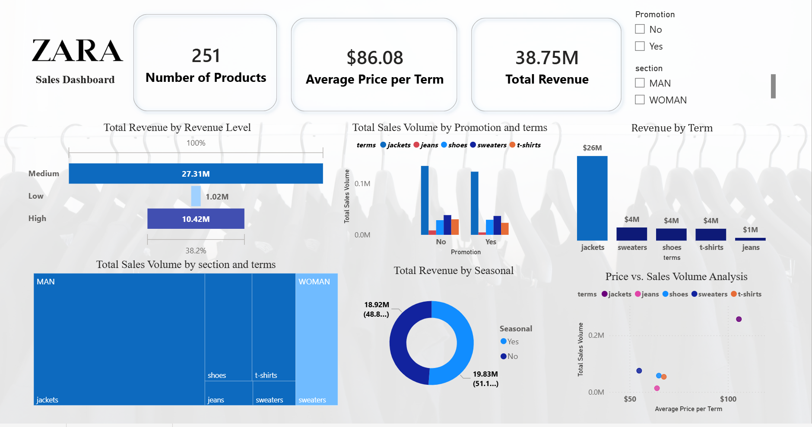

# Zara Sales Performance Analysis 📊

## Overview
This **Power BI** project provides a deep dive into the sales performance of **Zara**. The dashboard transforms raw retail data into actionable business insights.

## 🖼️ Dashboard Preview

## 💡 Key Business Insights
* **Revenue Leadership**: The 'MAN' section is the primary revenue driver, contributing **$35M** (91.55% of total sales).
* **Pricing Strategy**: Analyzed the correlation between unit price and sales volume using a **Scatter Plot**.
* **Product Assortment**: Analyzed a portfolio of **251 unique products (SKUs)**.
* **Seasonality & Promotions**: Evaluated the impact of seasonal trends and promotional offers.

## 📂 Repository Structure
* `Zara Project.pbix`: The complete Power BI project file.
* `zara.csv`: The raw dataset used for this analysis.
* `Zara Project Dashboard.png`: A high-resolution screenshot of the final dashboard.

## 🚀 How to Explore
1. Download the `Zara Project.pbix` file.
2. Open it using **Power BI Desktop**.
